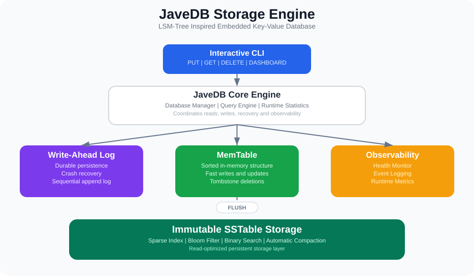
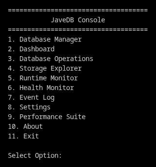
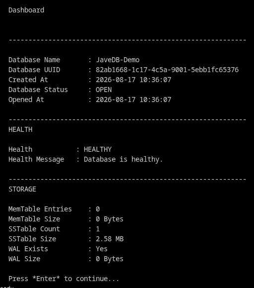
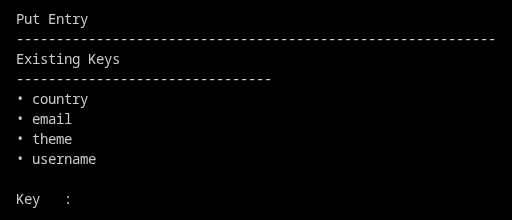
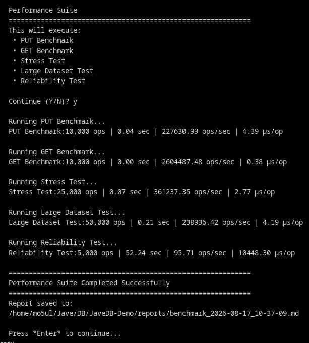

# **JaveDB - Embedded Key-Value Database in Java using an LSM-Tree Storage Engine**

JaveDB is a lightweight embedded database built from scratch in Java. It implements Write-Ahead Logging (WAL), MemTables, immutable SSTables, Bloom Filters, Sparse Indexing, Tombstones, and Automatic Compaction.

---

## Tech Stack

- **Language:** Java 21
- **Build Tool:** Maven
- **Storage Engine:** LSM-Tree
- **Persistence:** WAL + SSTables
- **License:** MIT

---

## Core Features

- Durable Write-Ahead Log (WAL)
- In-memory MemTable
- Immutable SSTables
- Bloom Filter for efficient lookups
- Sparse Index with binary search
- Tombstone-based deletion
- Automatic SSTable Compaction
- Runtime Dashboard & Health Monitor
- Integrated Performance Benchmark Suite

---

## Architecture

The storage engine follows an LSM-tree inspired architecture where writes are first persisted to the Write-Ahead Log (WAL), stored in the MemTable, and later flushed into immutable SSTables with Sparse Indexing, Bloom Filters, and Automatic Compaction.

---

## Performance Snapshot

| Benchmark | Throughput |
|-----------|-----------:|
| PUT | **227,631 ops/sec** |
| GET | **2,604,487 ops/sec** |
| Stress Test | **361,237 ops/sec** |
| Large Dataset | **238,936 ops/sec** |
| Reliability | **96 ops/sec** |

---

## CLI Preview

### Main Menu

### Runtime Dashboard

### Put Entry

### Performance Suite

## Documentation

| Document | Description |
|----------|-------------|
| `docs/architecture.svg` | Storage engine architecture |
| `docs/USAGE.md` | CLI usage guide |
| `docs/API.md` | Public API documentation |
| `docs/benchmark/performance-report.md` | Complete benchmark report |

---

## Author

**Mohul Roy Chowdhury (mo5ul)**

Embedded Database • Systems Programming • Java